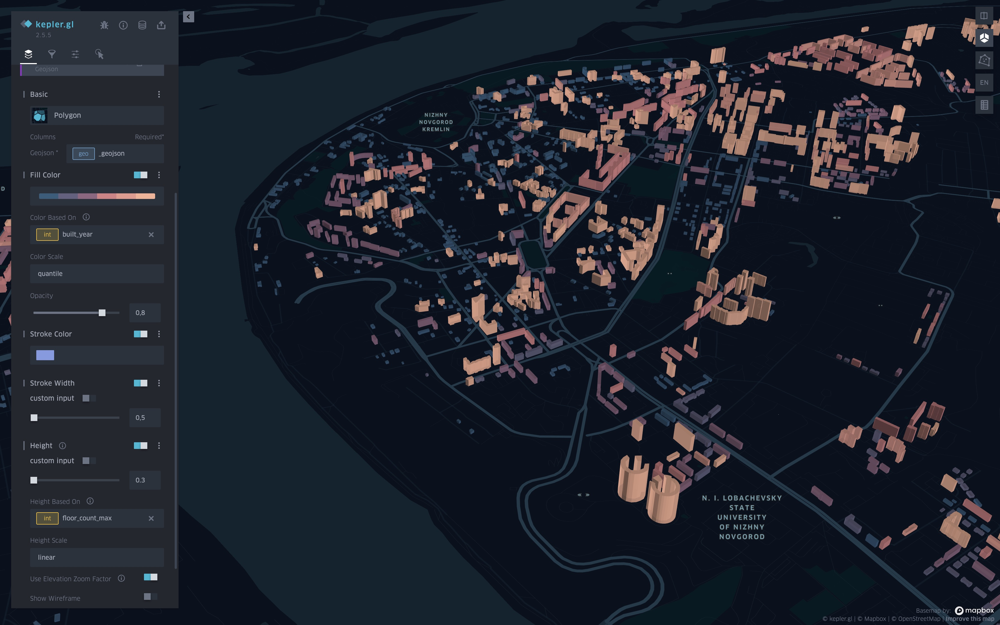
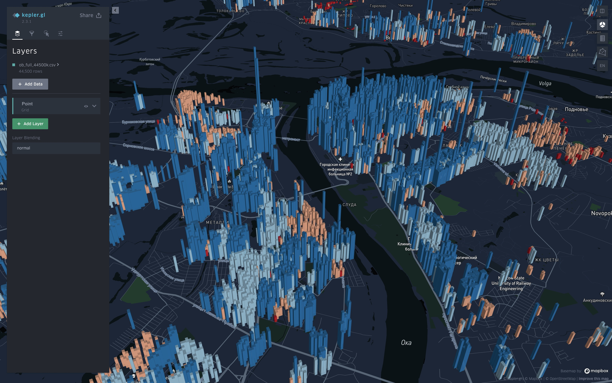
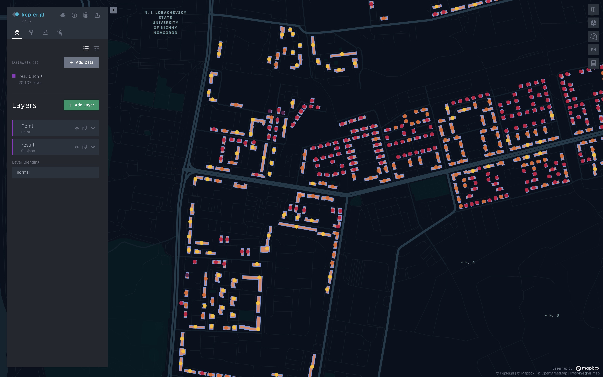
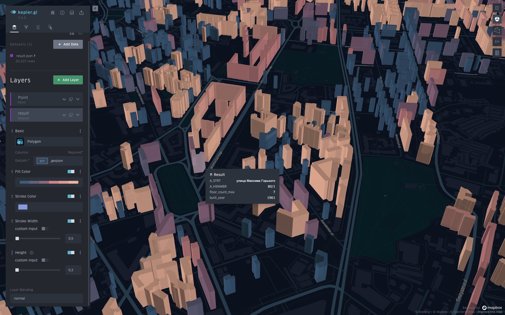

# Nizhny_Novgorod_3d_map

## Project structure
 - data
    * buildings.json - geojson, raw OSM data with 2d polygons
    * reestr.csv - information about buildings
    * gecoded_data.csv - info with coordinates
    * result.json - geojson, OSM data joined with info
    * kepler_map.html - final kepler.gl map
 - notebooks
    * 1.Geocoder.ipnb - example of usage Yandex.Geocoder
    * 2.Matcher.ipynb - joining gecoded_data with polygons using GeoPadnas
- env.txt - installation of GeoPandas in separate python env

## Story about project

Now I'm going to show you how I could create a 3D map of my hometown using 2D polygons, table with info about buildings, Geocoder, [GeoPandas](https://geopandas.org), [Kepler.gl](https://kepler.gl/). 

Map like that

## Task

What was my task about? When i worked at Niznhy Novgorod's company 2 years ago, i got a task to create a visualization of old and emergency buildings. I got the table, there were address, number of floors, year of construction and boolean emergency flag.

| address | floor_count_max | built_year | is_alarm |
|-------------------------------------------------------------------:|----------------:| ----------:| --------:|
| д. г Навашино ул Соболева д.1 | 2 | 1954 | Нет |
| обл. Нижегородская, р-н. Ардатовский, рп. Ардатов, ул. 1 Мая, д. 32 | 5 | 1977 | Нет |

## Geocoder
My first idea was: "Okay, i could receive coordinates and display them on the map." When I worked at Yandex.Map and we often used [Yandex.Geocoder](https://yandex.com/dev/maps/geocoder/). I remembered that service well, it was our bottleneck. But it has strong terms of use. Of course, for Russia, Yandex is better, but I need to store several thousand points, so I decided to use free services. This is a good [post](https://habr.com/ru/post/499990/) about geocoding. I got a good idea from the comments. I can use the free service and send some problematic cases to Yandex.

Okay, i had coordinates. What's next? I discovered a perfect geo visualization tool from Uber - [Kepler.gl](https://kepler.gl/). I made my first attempt. It was awful. There were octagons or rectangles instead of real buildings. But I can regularize their colors and height depending on different columns. Height depend on floors and colors depend on, for example, built year. I really liked it. But my boss didn't.

## 2d Polygons
I started to find ways to make it better. And I found 2D polygons. I downloaded it from a site like [that](http://download.geofabrik.de/russia/volga-fed-district.html). Cut my region off. This is a good [post](https://habr.com/ru/post/463251/) about it. And i had a problem. I should have matched my coordinates of buildings with polygons. I started to write my own code based on this [algorithm](https://en.wikipedia.org/wiki/Point_in_polygon). As a result, it was very slow. But i did it. I got an acceptable result, and my boss was pleased.

When I decided to make a repo, I found this awesome [post](https://www.matecdev.com/posts/point-in-polygon.html#use-the-optimized-pygeos-library) about the same problems, but it used [GeoPandas](https://geopandas.org). It's beautiful. I got a speed gain of a hundred times. It matched all coordinates with polygons for 2 seconds. You can run it.

## Result and Future development
And I get a good result. I was really proud of myself. I created my own Yandex.Map or 2GIS. And everyone can add additional information to each building, for example, images, historical information, etc. Each building has its own info card. This is a growth point.

As you can see, I had many polygons without matching. I can improve my geocoding or download more complete raw data. But for me, it was a study task, and I worked with given data.
